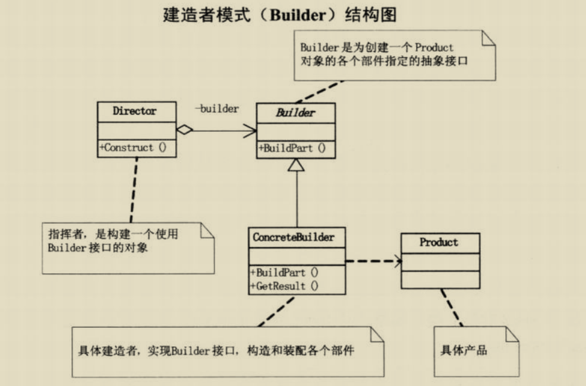

# 建造者模式
## 传统的建造者模式
####需求:
##### 1. 程序画一个小人,有头,两只手,身体,两只脚组成
```java
public class Drawing() {
  public static void main(String[] args){
    Pen p = new Pen(Color.Yellow);
    Graphics graphics = pictureBox1.createGraphics();
    graphics.drawEllipse(p, 50, 20, 30 ,30); // 头
    //.. 画身体,手,脚等 
  }
}
```
##### 2. 现在需要再画一个胖点的人
```java
public class Drawing() {
  public static void main(String[] args){
    // ... 画第一个小人的代码
    
    // 画第二个小人
    Pen p = new Pen(Color.Yellow);
    Graphics graphics = pictureBox1.createGraphics();
    graphics.drawEllipse(p, 50, 20, 30 ,30); // 头
    //.. 画手,脚等 
    // 画一个胖点的身体
  }
}
```
> 画小人的过程中头,手,脚这些工作又重复的做了一遍,而对于人来说这些是必须的;
为了复用画瘦的人和胖的人把程序拆分

```java
public class PersonThinBuilder{
  private Graphics g;
  private Pen p;
  public PersonThinBuilder(Graphics g, Pen p) {
    this.g = g;
    this.p = p;
  }
  
  public void build() {
    g.drawEllipse(p, 50, 20 ,30, 30);
    // ...画其他部位
  }

}
// ... 构建胖子的构建器类似不在写了

// 使用
public class TestBuild(){
  public static void main(String[] args){
    Pen p = new Pen(Collow.Yellow);
    Graphics g = pictureBox1.createGraphics();
    PersonThinBuilder ptb = new PersonThinBuilder(p,g);
    ptb.build();
    PersonFatBuilder pfb = new PersonFatBuilder(p,g);
    pfb.build();

  }
}
```
> 这样写虽然能够打到复用两个画小人的程序,但是build的过程步骤还是不够明晰
>可能在构建一个高个子的时候会漏掉某些东西导致构建错误;最好的办法是对构建的过程做好规定
>比如构造小人 必须有头和身体以及两只手和两只脚


# 什么是建造者模式
> 需要对于一个复杂对象的构建与它的表示分离,使得同样的构建过程可以创造不同的表示的意图时,我们就需要建造者模式(生成器模式);

建造者模式可以将一个产品的内部表象与产品的生成过程分割开来,从而使一个建造过程生成具有不同的内部表象的产品对象;
产品的内部表象(胖子,瘦子,高个子)与产品的生成(构建胖子瘦子高个子..);

使用了建造者模式后,用户只需要指定需要建造的类型就可以得到他们,不用知道具体的过程和细节;

对于画小人来说 需要的画 头 身体 两只手 两只脚
首先对这些步骤确定下来,保证用户在构建的时候不会遗忘这些步骤
```java
public abstract class PersonBuilder {
  protected Graphics g;
  protected Pen p;
  public PersonBuilder(Graphics g,Pen p) {
    this.g = g;
    this.p = p;
  }
  abstract void buildHead();
  abstract void buildBody();
  abstract void buildArmLef();
  abstract void buildArmRight();
  abstract void buildLegLeft();
  abstract void buildLegRight();

}

public class PersonThinBuilder extends PersonBuilder{

  @Override
  public void buildHead() {
    g.drawEllipse(p, 50, 20 ,30);
  } 
  @Override
  public void buildBody() {
    g.drawEllipse(p, 50, 20 ,30);
  } 
  @Override
  public void buildArmLef() {
    g.drawEllipse(p, 50, 20 ,30);
  } 
  // ....
}
// 胖子的构造代码类似
```
> 通过继承把构造的过程确定下来了,还需要一个构造步骤构建指挥(Director)

```java
public class PersonDirector{
  private PersonBuilder pb;
  public PersonDirector(PersonBuilder builder) {
    this.pb = builder;
  }
  void build() {
    pb.buildHead();
    pb.buildBody();
    pb.buildArmLeft();
    pb.buildArmRight();
    pb.buildLegLeft();
    pb.buildLegRight();
  }
}
```


> 为了创建一个Product对象的各个部件指定的抽象接口;
> ConcreteBuilder时具体的构建这,实现Builder的接口,构造和装配各个部件
> Product 是构建的产品
> Director 是构建器

> 该模式主要用于创建一些复杂的对象,这些对象内部构建间的建造顺序通常是稳定的,但是对象内部的构建通常面临着复杂的变化;

## 简化版的建造模式
> 当一个类的构造函数参数个数超过4个，而且这些参数有些是可选的参数，考虑使用这种构造者模式。 

```java
// 一台电脑必须有cpu ram ,而usb接口,键盘 显示器是可选的
public class Computer {
    private String cpu;//必须
    private String ram;//必须
    private int usbCount;//可选
    private String keyboard;//可选
    private String display;//可选
}
// 第一种做法
public class Computer {
    //...
    public Computer(String cpu, String ram) {
        this(cpu, ram, 0);
    }
    public Computer(String cpu, String ram, int usbCount) {
        this(cpu, ram, usbCount, "罗技键盘");
    }
    public Computer(String cpu, String ram, int usbCount, String keyboard) {
        this(cpu, ram, usbCount, keyboard, "三星显示器");
    }
    public Computer(String cpu, String ram, int usbCount, String keyboard, String display) {
        this.cpu = cpu;
        this.ram = ram;
        this.usbCount = usbCount;
        this.keyboard = keyboard;
        this.display = display;
    }
}
// 第二种做法
public class Computer {
    //  ...

    public String getCpu() {
        return cpu;
    }
    public void setCpu(String cpu) {
        this.cpu = cpu;
    }
    public String getRam() {
        return ram;
    }
    public void setRam(String ram) {
        this.ram = ram;
    }
    public int getUsbCount() {
        return usbCount;
    }
    //...
}
```
> 第一种主要是使用及阅读不方便。你可以想象一下，当你要调用一个类的构造函数时，你首先要决定使用哪一个，然后里面又是一堆参数，如果这些参数的类型很多又都一样，你还要搞清楚这些参数的含义，很容易就传混了。。。那酸爽谁用谁知道。
  第二种方式在构建过程中对象的状态容易发生变化，造成错误。因为那个类中的属性是分步设置的，所以就容易出错。

```java
public class Computer {
    private final String cpu;//必须
    private final String ram;//必须
    private final int usbCount;//可选
    private final String keyboard;//可选
    private final String display;//可选
    private Computer(Builder builder){
        this.cpu=builder.cpu;
        this.ram=builder.ram;
        this.usbCount=builder.usbCount;
        this.keyboard=builder.keyboard;
        this.display=builder.display;
    }
    public static class Builder{
        private String cpu;//必须
        private String ram;//必须
        private int usbCount;//可选
        private String keyboard;//可选
        private String display;//可选

        public Builder(String cup,String ram){
            this.cpu=cup;
            this.ram=ram;
        }

        public Builder setUsbCount(int usbCount) {
            this.usbCount = usbCount;
            return this;
        }
        public Builder setKeyboard(String keyboard) {
            this.keyboard = keyboard;
            return this;
        }
        public Builder setDisplay(String display) {
            this.display = display;
            return this;
        }        
        public Computer build(){
            return new Computer(this);
        }
    }
    //省略getter方法

    // 使用
    public static void main(String[] args) {
      Computer computer=new Computer.Builder("因特尔","三星")
                      .setDisplay("三星24寸")
                      .setKeyboard("罗技")
                      .setUsbCount(2)
                      .build();
    }

}


```
