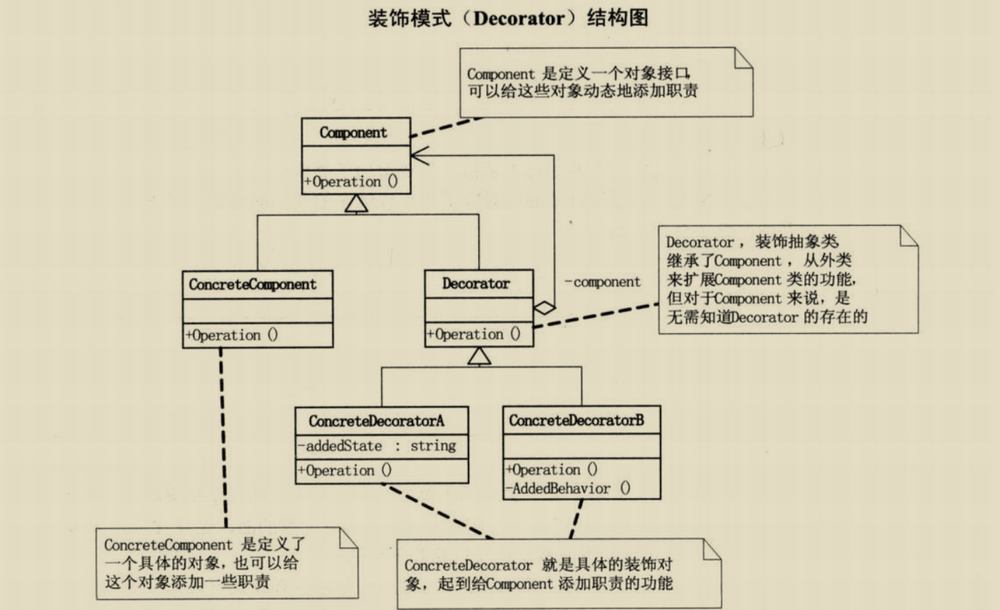

# 装饰器模式
>装饰模式可以动态的给一个对象增加一些额外的功能(增强功能) 相比于继承，装饰模式能对不支持继承的类进行增强；并且比继承更灵活，不需要生成大量的子类。

1. Component抽象构件角色：真实对象和装饰对象有相同的接口。这样，客户端对象就能够以与真实对象相同的方式同装饰对象交互。
2. ConcreteComponent具体构件角色：定义一个具体的对象，也可以给这个对象添加一些职责。
3. Decorator装饰角色：持有一个抽象构件的引用。装饰对象接受所有客户端的请求，并把这些请求转发给真实的对象。这样，就能在真实对象调用前后增加新的功能。
4. ConcreteDecorator具体装饰角色：负责给构件对象增加新的责任。Target匹配的接口。对Adaptee的接口与Target接口进行适配。
5. 在有些时候(只有一个装饰者的时候,或者不使用decorator方法,直接通过构造装饰每个装饰者直接在构造函数中引入具体构件)可以省略掉Decorator,将装饰角色的功能直接写在具体的装饰角色中

