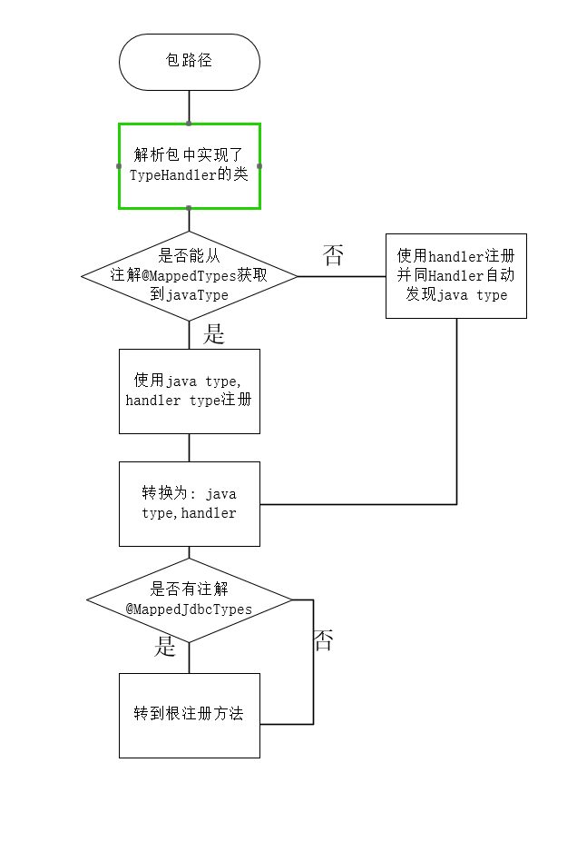

# SqlSessionFactory创建
## 查看build过程
```java
public class MybatisTest {
    private SqlSessionFactory sqlSessionFactory;
    @Before
    public void initFactory() throws IOException {
        String resource = "mybatis-config.xml";
        InputStream sourceStream = Resources.getResourceAsStream(resource);
        sqlSessionFactory = new SqlSessionFactoryBuilder().build(sourceStream);
        sourceStream.close();
    }


}

// SqlSessionFactoryBuilder 的 核心方法 build
public class SqlSessionFactoryBuilder {
    public SqlSessionFactory build(Reader reader, String environment, Properties properties) {
        try {
            // 读取流, 额外的环境配置, 额外的属性配置 (properties中的属性写入configuration)
            XMLConfigBuilder parser = new XMLConfigBuilder(reader, environment, properties);
            // xml配置解析器解析后返回 Configuration, parse.parse()是整合配置文件中的config并返回
            return build(parser.parse());
        } catch (Exception e) {
            throw ExceptionFactory.wrapException("Error building SqlSession.", e);
        } finally {
            ErrorContext.instance().reset();
            try {
            reader.close();
            } catch (IOException e) {
            // Intentionally ignore. Prefer previous error.
            }
        }
    }
    // 获取解析后的config并创建sqlSessionFactory (随后分析)
    public SqlSessionFactory build(Configuration config) {
     return new DefaultSqlSessionFactory(config);
    }


}


```
## 分析parse.pares()
```java
public class XMLConfigBuilder {
  public Configuration parse() {
    if (parsed) {
      throw new BuilderException("Each XMLConfigBuilder can only be used once.");
    }
    parsed = true;
    // 获取mybatis-config.xml中的configuration根节点下的XNode
    parseConfiguration(parser.evalNode("/configuration"));
    return configuration;
  }

  // 对configuration下的node内容进行逐个解析
  private void parseConfiguration(XNode root) {
    try {
      // 解析properties
      propertiesElement(root.evalNode("properties"));
      // 解析settings
      Properties settings = settingsAsProperties(root.evalNode("settings"));
      // 	指定 VFS 的实现 如果设置了则指定
      loadCustomVfs(settings);
      // 指定 MyBatis 所用日志的具体实现
      loadCustomLogImpl(settings);
      // 解析typeAliases
      typeAliasesElement(root.evalNode("typeAliases"));
      // 解析plugins
      pluginElement(root.evalNode("plugins"));
      objectFactoryElement(root.evalNode("objectFactory"));
      objectWrapperFactoryElement(root.evalNode("objectWrapperFactory"));
      reflectorFactoryElement(root.evalNode("reflectorFactory"));
      settingsElement(settings);
      // read it after objectFactory and objectWrapperFactory issue #631
      environmentsElement(root.evalNode("environments"));
      databaseIdProviderElement(root.evalNode("databaseIdProvider"));
      typeHandlerElement(root.evalNode("typeHandlers"));
      mapperElement(root.evalNode("mappers"));
    } catch (Exception e) {
      throw new BuilderException("Error parsing SQL Mapper Configuration. Cause: " + e, e);
    }
  }
}
  
```
### 解析properties
进入propertiesElement中看它做了什么
xml配置中的properties标签的常用写法为(来源于mybatis3的官网)
```xml
<properties resource="org/mybatis/example/config.properties">
  <property name="username" value="dev_user"/>
  <property name="password" value="F2Fa3!33TYyg"/>
</properties>
```
```java
public class XMLConfigBuilder{
    // 解析xml中的properties标签
    private void propertiesElement(XNode context) throws Exception {
        if (context != null) {
          // 读取xml中properties标签下的子节点 property 中的name和value属性作为key:value并返回 Properties extends Hashtable<Object,Object>
          Properties defaults = context.getChildrenAsProperties();
          // 查看节点上的resource属性 和url属性
          String resource = context.getStringAttribute("resource");
          String url = context.getStringAttribute("url");
          // 同时存在报错, 这两个属性只能存在一个
          if (resource != null && url != null) {
            throw new BuilderException("The properties element cannot specify both a URL and a resource based property file reference.  Please specify one or the other.");
          }
          // defaults中的propery的name和value会被resource或url覆盖,如果存在的话
          if (resource != null) {
            // 从properties中读取key:value
            defaults.putAll(Resources.getResourceAsProperties(resource));
          } else if (url != null) {
            // 从url中读取key:value
            defaults.putAll(Resources.getUrlAsProperties(url));
          }
          // 获取初始化后的configuration(这个configuration已经在build的时候创建并写入了传入的properties的数据)
          Properties vars = configuration.getVariables();
          if (vars != null) {
            // 如果配置了 resource或者url属性 若和传入的properties的内容冲突,则会用resource或url中读取的内容覆盖
            defaults.putAll(vars);
          }
          // 解析器和configuration指定 properties 
          parser.setVariables(defaults);
          configuration.setVariables(defaults);
        }
    }
    
}  
  
```
### 解析settings
在了解settings的解析过程前需要先看[MateClass](mybatis/mate)类的内容,这便于理解settings的解析过程
> 一个配置完整的 settings 元素的示例如下：
```xml
<settings>
  <setting name="cacheEnabled" value="true"/>
  <setting name="lazyLoadingEnabled" value="true"/>
  <setting name="multipleResultSetsEnabled" value="true"/>
  <setting name="useColumnLabel" value="true"/>
  <setting name="useGeneratedKeys" value="false"/>
  <setting name="autoMappingBehavior" value="PARTIAL"/>
  <setting name="autoMappingUnknownColumnBehavior" value="WARNING"/>
  <setting name="defaultExecutorType" value="SIMPLE"/>
  <setting name="defaultStatementTimeout" value="25"/>
  <setting name="defaultFetchSize" value="100"/>
  <setting name="safeRowBoundsEnabled" value="false"/>
  <setting name="mapUnderscoreToCamelCase" value="false"/>
  <setting name="localCacheScope" value="SESSION"/>
  <setting name="jdbcTypeForNull" value="OTHER"/>
  <setting name="lazyLoadTriggerMethods" value="equals,clone,hashCode,toString"/>
</settings>
```

```java
public class XMLConfigBuilder extends BaseBuilder {
  
  private Properties settingsAsProperties(XNode context) {
    // settings中无配置
    if (context == null) {
      return new Properties();
    }
    
    Properties props = context.getChildrenAsProperties();
    // 查看Configuration.class的元信息
    MetaClass metaConfig = MetaClass.forClass(Configuration.class, localReflectorFactory);
    for (Object key : props.keySet()) {
      // settings中设置的name属性Configuration中是否有
      if (!metaConfig.hasSetter(String.valueOf(key))) {
        throw new BuilderException("The setting " + key + " is not known.  Make sure you spelled it correctly (case sensitive).");
      }
    }
    // 存在则返回这个属性
    return props;
  }
  

}
```

### 类型别名解析
```xml
<typeAliases>
  <typeAlias alias="Author" type="domain.blog.Author"/>
  <typeAlias alias="Blog" type="domain.blog.Blog"/>
  <typeAlias alias="Comment" type="domain.blog.Comment"/>
  <typeAlias alias="Post" type="domain.blog.Post"/>
  <typeAlias alias="Section" type="domain.blog.Section"/>
  <typeAlias alias="Tag" type="domain.blog.Tag"/>
  <package name="domain.blog"/>
</typeAliases>
```
```java

public class XMLConfigBuilder extends BaseBuilder {
  private void typeAliasesElement(XNode parent) {
    if (parent != null) {
      for (XNode child : parent.getChildren()) {
        // 标签名是package(扫描包下的所有类(不包括内部类及接口及匿名类, 如果使用@alias注解则使用注解的value作为名称,否则使用类的simpleName作为name)
        if ("package".equals(child.getName())) {
          // 解析出name
          String typeAliasPackage = child.getStringAttribute("name");
          // 注册包路径 => 01 
          configuration.getTypeAliasRegistry().registerAliases(typeAliasPackage);
        } else {
          // 使用了typeAlias 如果有alias则使用定义的名称 否则使用类注解@Alias的名称 或 类的SimpleName 如果没有type则报错
          String alias = child.getStringAttribute("alias");
          String type = child.getStringAttribute("type");
          try {
            Class<?> clazz = Resources.classForName(type);
            if (alias == null) {
              typeAliasRegistry.registerAlias(clazz);
            } else {
              typeAliasRegistry.registerAlias(alias, clazz);
            }
          } catch (ClassNotFoundException e) {
            throw new BuilderException("Error registering typeAlias for '" + alias + "'. Cause: " + e, e);
          }
        }
      }
    }
  }
  // 01 解析包路径下的类
  public void registerAliases(String packageName) {
    registerAliases(packageName, Object.class);
  }
  public void registerAliases(String packageName, Class<?> superType) {
    ResolverUtil<Class<?>> resolverUtil = new ResolverUtil<>();
    // 使用ResolverUtil类查找出包下的所有类 (Object的子类)
    resolverUtil.find(new ResolverUtil.IsA(superType), packageName);
    Set<Class<? extends Class<?>>> typeSet = resolverUtil.getClasses();
    for (Class<?> type : typeSet) {
      // Ignore inner classes and interfaces (including package-info.java)
      // Skip also inner classes. See issue #6
      // 排除内部类接口匿名类
      if (!type.isAnonymousClass() && !type.isInterface() && !type.isMemberClass()) {
        registerAlias(type);
      }
    }
  }  
  // 注册别名
  public void registerAlias(Class<?> type) {
    // 获取类的简称
    String alias = type.getSimpleName();
    // 查看类中是有注解 @Alias 有使用注解中定义的alias
    Alias aliasAnnotation = type.getAnnotation(Alias.class);
    if (aliasAnnotation != null) {
      alias = aliasAnnotation.value();
    }
    // 注册alias
    registerAlias(alias, type);
  }
  
  // 存储当前解析的 alias 和 对应的类型
  public void registerAlias(String alias, Class<?> value) {
    if (alias == null) {
      throw new TypeException("The parameter alias cannot be null");
    }
    // issue #748
    String key = alias.toLowerCase(Locale.ENGLISH);
    if (typeAliases.containsKey(key) && typeAliases.get(key) != null && !typeAliases.get(key).equals(value)) {
      throw new TypeException("The alias '" + alias + "' is already mapped to the value '" + typeAliases.get(key).getName() + "'.");
    }
    typeAliases.put(key, value);
  }

}
```

### Mybatis默认注册的别名
```java
public class Configuration{
  public Configuration() {
    typeAliasRegistry.registerAlias("JDBC", JdbcTransactionFactory.class);
    typeAliasRegistry.registerAlias("MANAGED", ManagedTransactionFactory.class);

    typeAliasRegistry.registerAlias("JNDI", JndiDataSourceFactory.class);
    typeAliasRegistry.registerAlias("POOLED", PooledDataSourceFactory.class);
    typeAliasRegistry.registerAlias("UNPOOLED", UnpooledDataSourceFactory.class);

    typeAliasRegistry.registerAlias("PERPETUAL", PerpetualCache.class);
    typeAliasRegistry.registerAlias("FIFO", FifoCache.class);
    typeAliasRegistry.registerAlias("LRU", LruCache.class);
    typeAliasRegistry.registerAlias("SOFT", SoftCache.class);
    typeAliasRegistry.registerAlias("WEAK", WeakCache.class);

    typeAliasRegistry.registerAlias("DB_VENDOR", VendorDatabaseIdProvider.class);

    typeAliasRegistry.registerAlias("XML", XMLLanguageDriver.class);
    typeAliasRegistry.registerAlias("RAW", RawLanguageDriver.class);

    typeAliasRegistry.registerAlias("SLF4J", Slf4jImpl.class);
    typeAliasRegistry.registerAlias("COMMONS_LOGGING", JakartaCommonsLoggingImpl.class);
    typeAliasRegistry.registerAlias("LOG4J", Log4jImpl.class);
    typeAliasRegistry.registerAlias("LOG4J2", Log4j2Impl.class);
    typeAliasRegistry.registerAlias("JDK_LOGGING", Jdk14LoggingImpl.class);
    typeAliasRegistry.registerAlias("STDOUT_LOGGING", StdOutImpl.class);
    typeAliasRegistry.registerAlias("NO_LOGGING", NoLoggingImpl.class);

    typeAliasRegistry.registerAlias("CGLIB", CglibProxyFactory.class);
    typeAliasRegistry.registerAlias("JAVASSIST", JavassistProxyFactory.class);

    languageRegistry.setDefaultDriverClass(XMLLanguageDriver.class);
    languageRegistry.register(RawLanguageDriver.class);
  }
}

public class TypeAliasRegistry{
  public TypeAliasRegistry() {
    registerAlias("string", String.class);

    registerAlias("byte", Byte.class);
    registerAlias("long", Long.class);
    registerAlias("short", Short.class);
    registerAlias("int", Integer.class);
    registerAlias("integer", Integer.class);
    registerAlias("double", Double.class);
    registerAlias("float", Float.class);
    registerAlias("boolean", Boolean.class);

    registerAlias("byte[]", Byte[].class);
    registerAlias("long[]", Long[].class);
    registerAlias("short[]", Short[].class);
    registerAlias("int[]", Integer[].class);
    registerAlias("integer[]", Integer[].class);
    registerAlias("double[]", Double[].class);
    registerAlias("float[]", Float[].class);
    registerAlias("boolean[]", Boolean[].class);

    registerAlias("_byte", byte.class);
    registerAlias("_long", long.class);
    registerAlias("_short", short.class);
    registerAlias("_int", int.class);
    registerAlias("_integer", int.class);
    registerAlias("_double", double.class);
    registerAlias("_float", float.class);
    registerAlias("_boolean", boolean.class);

    registerAlias("_byte[]", byte[].class);
    registerAlias("_long[]", long[].class);
    registerAlias("_short[]", short[].class);
    registerAlias("_int[]", int[].class);
    registerAlias("_integer[]", int[].class);
    registerAlias("_double[]", double[].class);
    registerAlias("_float[]", float[].class);
    registerAlias("_boolean[]", boolean[].class);

    registerAlias("date", Date.class);
    registerAlias("decimal", BigDecimal.class);
    registerAlias("bigdecimal", BigDecimal.class);
    registerAlias("biginteger", BigInteger.class);
    registerAlias("object", Object.class);

    registerAlias("date[]", Date[].class);
    registerAlias("decimal[]", BigDecimal[].class);
    registerAlias("bigdecimal[]", BigDecimal[].class);
    registerAlias("biginteger[]", BigInteger[].class);
    registerAlias("object[]", Object[].class);

    registerAlias("map", Map.class);
    registerAlias("hashmap", HashMap.class);
    registerAlias("list", List.class);
    registerAlias("arraylist", ArrayList.class);
    registerAlias("collection", Collection.class);
    registerAlias("iterator", Iterator.class);

    registerAlias("ResultSet", ResultSet.class);
  }  
}
```

### plugins 解析(用于插件扩展)
```java
// ExamplePlugin.java
@Intercepts({@Signature(
  type= Executor.class,
  method = "update",
  args = {MappedStatement.class,Object.class})})
public class ExamplePlugin implements Interceptor {
  private Properties properties = new Properties();
  public Object intercept(Invocation invocation) throws Throwable {
    // implement pre processing if need
    Object returnObject = invocation.proceed();
    // implement post processing if need
    return returnObject;
  }
  public void setProperties(Properties properties) {
    this.properties = properties;
  }
}

```
```xml
<!-- mybatis-config.xml -->
<plugins>
  <plugin interceptor="org.mybatis.example.ExamplePlugin">
    <property name="someProperty" value="100"/>
  </plugin>
</plugins>
```
解析源码
```java
public class XMLConfigBuilder{
  // ...省略代码


  private void pluginElement(XNode parent) throws Exception {
    if (parent != null) {
      for (XNode child : parent.getChildren()) {
        // 查看plugins节点下的拦截器
        String interceptor = child.getStringAttribute("interceptor");
        // 解析拦截器中的参数
        Properties properties = child.getChildrenAsProperties();
        // 反射获取拦截器对象 (实现了Interceptor)
        Interceptor interceptorInstance = (Interceptor) resolveClass(interceptor).getDeclaredConstructor().newInstance();
        // 设置实例属性
        interceptorInstance.setProperties(properties);
        // 添加拦截器到配置.. (拦截器什么时候使用目前先不管)
        configuration.addInterceptor(interceptorInstance);
      }
    }
  }


  // ...省略代码

}

// 拦截器接口
public interface Interceptor {

  Object intercept(Invocation invocation) throws Throwable;

  default Object plugin(Object target) {
    return Plugin.wrap(target, this);
  }

  default void setProperties(Properties properties) {
    // NOP
  }

}
```
查看源码后我们知道
1. 配置插件需要实现Interceptor接口的intercept方法
2. 可以给插件添加属性通过property添加属性
3. 使用@Intercepts 或 @Signature 注解配置 注解的具体配置和可配置项以后再说
4. 拦截器实例会被添加到Configuration中使用(具体后面分析)


### objectFactoryElement 对象工厂扩展
与扩展插件类似,可以通过继承默认的对象工厂来扩展想要的东西
> 官方对于对象工厂作用的说明
>每次 MyBatis 创建结果对象的新实例时，它都会使用一个对象工厂（ObjectFactory）实例来完成实例化工作。 
默认的对象工厂需要做的仅仅是实例化目标类，要么通过默认无参构造方法，要么通过存在的参数映射来调用带有参数的构造方法。 如果想覆盖对象工厂的默认行为，可以通过创建自己的对象工厂来实现。比如：
```java
// ExampleObjectFactory.java
public class ExampleObjectFactory extends DefaultObjectFactory {
  public Object create(Class type) {
    return super.create(type);
  }
  public Object create(Class type, List<Class> constructorArgTypes, List<Object> constructorArgs) {
    return super.create(type, constructorArgTypes, constructorArgs);
  }
  public void setProperties(Properties properties) {
    super.setProperties(properties);
  }
  public <T> boolean isCollection(Class<T> type) {
    return Collection.class.isAssignableFrom(type);
  }
}
```
```xml
<objectFactory type="org.mybatis.example.ExampleObjectFactory">
  <property name="someProperty" value="100"/>
</objectFactory>
```
### objectWrapperFactoryElement
对象工厂包装类,可以对类进行再次包装,需要实现ObjectWrapperFactory,以后再研究
```java
// 默认实现(什么都没有做)
public class DefaultObjectWrapperFactory implements ObjectWrapperFactory {

  @Override
  public boolean hasWrapperFor(Object object) {
    return false;
  }

  @Override
  public ObjectWrapper getWrapperFor(MetaObject metaObject, Object object) {
    throw new ReflectionException("The DefaultObjectWrapperFactory should never be called to provide an ObjectWrapper.");
  }

}

```
### reflectorFactoryElement
反射器工厂对象 ReflectorFactory 默认实现是 DefaultReflectorFactory 可以配置并扩展功能

### settingsElement 
> configuration设置配置(如果settings中未配置会使用默认配置)

### environmentsElement环境解析
```xml
<environments default="development">
  <environment id="development">
    <transactionManager type="JDBC">
      <property name="..." value="..."/>
    </transactionManager>
    <dataSource type="POOLED">
      <property name="driver" value="${driver}"/>
      <property name="url" value="${url}"/>
      <property name="username" value="${username}"/>
      <property name="password" value="${password}"/>
    </dataSource>
  </environment>
</environments>
```
```java
public class XMLConfigBuilder{
  private void environmentsElement(XNode context) throws Exception {
    if (context != null) {
      if (environment == null) {
        // 获取 默认环境名称
        environment = context.getStringAttribute("default");
      }
      for (XNode child : context.getChildren()) {
        String id = child.getStringAttribute("id");
        // 检查是否指定了环境
        if (isSpecifiedEnvironment(id)) {
          // 根据node节点创建事务工厂类 (配置需要实现TransactionFactory接口的类,内部反射生成实例)
          TransactionFactory txFactory = transactionManagerElement(child.evalNode("transactionManager"));
          // 读取dataSource信息,反射创建DataSourceFactory
          // (前文已经注册了别称分别为 JNDI POOLED UNPOOLED 三个数据源,根据类型创建对应的数据源实例)
          // 也可以通过自定义数据的方式配置, typeAlias中配置别称及指定的数据源,然后在这里引用
          DataSourceFactory dsFactory = dataSourceElement(child.evalNode("dataSource"));
          DataSource dataSource = dsFactory.getDataSource();
          Environment.Builder environmentBuilder = new Environment.Builder(id)
              .transactionFactory(txFactory)
              .dataSource(dataSource);
          // 配置环境
          configuration.setEnvironment(environmentBuilder.build());
        }
      }
    }
  }
}

public class Environment{
  public static class Builder {
    private final String id;
    private TransactionFactory transactionFactory;
    private DataSource dataSource;
  }
}
```

> 关于TransactionFactory及DataSourceFactory的内容可以先通过官网查看,以后再具体说这两个东西

[Mybatis官网-environments](https://mybatis.org/mybatis-3/zh/configuration.html#environments)

### typeHandlers类型处理器
[Mybatis官网-typeHandlers](https://mybatis.org/mybatis-3/zh/configuration.html#typeHandlers)

自定义的类型处理器
```xml
<typeHandlers>
  <typeHandler handler="org.mybatis.example.ExampleTypeHandler"/>
</typeHandlers>

```
ExampleTypeHandler.java
```java
// ExampleTypeHandler.java
@MappedJdbcTypes(JdbcType.VARCHAR)
public class ExampleTypeHandler extends BaseTypeHandler<String> {

  @Override
  public void setNonNullParameter(PreparedStatement ps, int i, String parameter, JdbcType jdbcType) throws SQLException {
    ps.setString(i, parameter);
  }

  @Override
  public String getNullableResult(ResultSet rs, String columnName) throws SQLException {
    return rs.getString(columnName);
  }

  @Override
  public String getNullableResult(ResultSet rs, int columnIndex) throws SQLException {
    return rs.getString(columnIndex);
  }

  @Override
  public String getNullableResult(CallableStatement cs, int columnIndex) throws SQLException {
    return cs.getString(columnIndex);
  }
}
```


```java
public class TypeHandlerRegistry{
  public TypeHandlerRegistry(Configuration configuration) {
    this.unknownTypeHandler = new UnknownTypeHandler(configuration);

    register(Boolean.class, new BooleanTypeHandler());
    register(boolean.class, new BooleanTypeHandler());
    register(JdbcType.BOOLEAN, new BooleanTypeHandler());
    register(JdbcType.BIT, new BooleanTypeHandler());
    //...注册定义好的TypeHandler 可以查看Mybatis自己已经实现的TypeHandler
  }
}

@Documented
@Retention(RetentionPolicy.RUNTIME)
@Target(ElementType.TYPE)
public @interface MappedTypes {
  Class<?>[] value();
}

```


```java
public class XMLConfigBuilder{

  private void typeHandlerElement(XNode parent) {
    if (parent != null) {
      for (XNode child : parent.getChildren()) {
        if ("package".equals(child.getName())) {
          String typeHandlerPackage = child.getStringAttribute("name");
          // 使用ResourceUtil找到包下所有实现了TypeHandler的内容,进行处理器覆盖
          // 忽略内部类,接口,抽象类
          // 执行流程看上面
          // 包注册使用的Typehandler 需要使用@MappedTypes 和@MappedJdbcTypes获取javaTypeName 和 jdbcTypeName
          // 如果没有找到则自动发现 比如使用了BaseTypeHandler<T>则会自动发现javaTypeName 为 T  jdbcTypeName没有使用null注册
          typeHandlerRegistry.register(typeHandlerPackage);
        } else {
          String javaTypeName = child.getStringAttribute("javaType");
          String jdbcTypeName = child.getStringAttribute("jdbcType");
          String handlerTypeName = child.getStringAttribute("handler");
          Class<?> javaTypeClass = resolveClass(javaTypeName);
          JdbcType jdbcType = resolveJdbcType(jdbcTypeName);
          Class<?> typeHandlerClass = resolveClass(handlerTypeName);
          if (javaTypeClass != null) {
            if (jdbcType == null) {
              // 使用 jdbcType = null 注册空映射
              typeHandlerRegistry.register(javaTypeClass, typeHandlerClass);
            } else {
              // 全有直接注册
              typeHandlerRegistry.register(javaTypeClass, jdbcType, typeHandlerClass);
            }
          } else {
            // 自动发现注册
            typeHandlerRegistry.register(typeHandlerClass);
          }
        }
      }
    }
  }

}
```
## mapper.xml配置解析
```xml
<mappers>
  <mapper resource="org/mybatis/builder/PostMapper.xml"/>
</mappers>

<mappers>
  <mapper url="file:///var/mappers/AuthorMapper.xml"/>
</mappers>

<mappers>
  <mapper class="org.mybatis.builder.AuthorMapper"/>
</mappers>

<mappers>
  <package name="org.mybatis.builder"/>
</mappers>
```
```java

public class XMLConfigBuild{
  // 可以选择包路径注册 xml方式注册, url注册, class接口注册
  private void mapperElement(XNode parent) throws Exception {
    if (parent != null) {
      for (XNode child : parent.getChildren()) {
        if ("package".equals(child.getName())) {
          String mapperPackage = child.getStringAttribute("name");
          // 01 包解析映射
          configuration.addMappers(mapperPackage);
        } else {
          String resource = child.getStringAttribute("resource");
          String url = child.getStringAttribute("url");
          String mapperClass = child.getStringAttribute("class");
          if (resource != null && url == null && mapperClass == null) {
            ErrorContext.instance().resource(resource);
            InputStream inputStream = Resources.getResourceAsStream(resource);
            // 02 source路径注册 mapper.xml
            XMLMapperBuilder mapperParser = new XMLMapperBuilder(inputStream, configuration, resource, configuration.getSqlFragments());
            mapperParser.parse();
          } else if (resource == null && url != null && mapperClass == null) {
            ErrorContext.instance().resource(url);
            InputStream inputStream = Resources.getUrlAsStream(url);
            // url注册
            XMLMapperBuilder mapperParser = new XMLMapperBuilder(inputStream, configuration, url, configuration.getSqlFragments());
            mapperParser.parse();
          } else if (resource == null && url == null && mapperClass != null) {
            // class接口注册 interface
            Class<?> mapperInterface = Resources.classForName(mapperClass);
            configuration.addMapper(mapperInterface);
          } else {
            throw new BuilderException("A mapper element may only specify a url, resource or class, but not more than one.");
          }
        }
      }
    }
  }
}
```

### mapper.xml解析
```xml
<?xml version="1.0" encoding="UTF-8"?>
<!DOCTYPE mapper PUBLIC "-//mybatis.org//DTD Mapper 3.0//EN" "http://mybatis.org/dtd/mybatis-3-mapper.dtd">
<mapper namespace="com.song.dao.ArticleDao">
    <select id="findByAuthorAndCreateTime" resultType="com.song.po.Article">
        select id, title, author, content, create_time
        from article where author = #{author} and create_time = #{createTime}
    </select>
</mapper>
```
使用XMLMapperBuilder解析mapper.xml文件
```java

public class XMLMapperBuilder extends BaseBuilder {
  // xml路径解析器
  private final XPathParser parser;
  // mapper构建器
  private final MapperBuilderAssistant builderAssistant;
  // sql片段存储
  private final Map<String, XNode> sqlFragments;
  // 资源路径
  private final String resource;

  private XMLMapperBuilder(XPathParser parser, Configuration configuration, String resource, Map<String, XNode> sqlFragments) {
    // BaseBuilder获取基础配置信息
    super(configuration);
    // 用于缓存的
    this.builderAssistant = new MapperBuilderAssistant(configuration, resource);
    this.parser = parser;
    this.sqlFragments = sqlFragments;
    this.resource = resource;
  }

  
}

// mapper助手构建器(用于缓存)
public class MapperBuilderAssistant extends BaseBuilder {
  // 当前命名空间
  private String currentNamespace;
  // mapper路径
  private final String resource;
  // 当前缓存
  private Cache currentCache;
  // 未解析缓存
  private boolean unresolvedCacheRef; // issue #676

  public MapperBuilderAssistant(Configuration configuration, String resource) {
    super(configuration);
    ErrorContext.instance().resource(resource);
    this.resource = resource;
  }

}


```

### xml中mapper标签解析
```java
public class XMLMapperBuilder extends BaseBuilder {
  public void parse() {
    // 没有加载过的 加载
    if (!configuration.isResourceLoaded(resource)) {
      configurationElement(parser.evalNode("/mapper"));
      // 标记为已经加载过了(放入已经加载容器)
      configuration.addLoadedResource(resource);
      // mapper和命名空间绑定
      bindMapperForNamespace();
    }

    parsePendingResultMaps();
    parsePendingCacheRefs();
    parsePendingStatements();
  }
}
```
#### mapper解析
```java
public class XMLMapperBuilder extends BaseBuilder {
  private void configurationElement(XNode context) {
    try {
      // 解析命名空间
      String namespace = context.getStringAttribute("namespace");
      if (namespace == null || namespace.isEmpty()) {
        throw new BuilderException("Mapper's namespace cannot be empty");
      }
      // 构建缓存存储器
      // 设置命名空间(缓存构建器设置命名空间)
      builderAssistant.setCurrentNamespace(namespace);
      // 完善builderAssistant中的缓存使用
      cacheRefElement(context.evalNode("cache-ref"));
      // 解析缓存标签
      cacheElement(context.evalNode("cache"));
      // 解析parameterMap(已经弃用了)使用行内的
      parameterMapElement(context.evalNodes("/mapper/parameterMap"));
      // 解析resultMap
      resultMapElements(context.evalNodes("/mapper/resultMap"));
      // sql片段解析 最后赋值给sqlFragments Map<String, XNode> 
      sqlElement(context.evalNodes("/mapper/sql"));
      buildStatementFromContext(context.evalNodes("select|insert|update|delete"));
    } catch (Exception e) {
      throw new BuilderException("Error parsing Mapper XML. The XML location is '" + resource + "'. Cause: " + e, e);
    }
  }  
}
```
### cache 
[mybatis官网Cache](https://mybatis.org/mybatis-3/zh/sqlmap-xml.html#cache)
```xml
<cache
  eviction="FIFO"
  flushInterval="60000"
  size="512"
  readOnly="true"/>
```
```xml
<cache type="com.domain.something.MyCustomCache"/>
```
```java
public class XMLMapperBuilder extends BaseBuilder {
  private void cacheElement(XNode context) {
    if (context != null) {
      // 解析使用的缓存 默认 PerpetualCache 或者定义的缓存 MyCustomCache
      String type = context.getStringAttribute("type", "PERPETUAL");
      Class<? extends Cache> typeClass = typeAliasRegistry.resolveAlias(type);
      
      // 缓存策略 未设置默认使用 LruCache(缓存装饰)
      String eviction = context.getStringAttribute("eviction", "LRU");
      Class<? extends Cache> evictionClass = typeAliasRegistry.resolveAlias(eviction);
    
      // 缓存刷新间隔
      Long flushInterval = context.getLongAttribute("flushInterval");
      Integer size = context.getIntAttribute("size");
      
      // 缓存结构是否只读,默认 可读可写
      boolean readWrite = !context.getBooleanAttribute("readOnly", false);
      boolean blocking = context.getBooleanAttribute("blocking", false);
      
      // 自定义缓存中的属性
      Properties props = context.getChildrenAsProperties();
      // 使用缓存(分析一下是如何构建缓存的)
      builderAssistant.useNewCache(typeClass, evictionClass, flushInterval, size, readWrite, blocking, props);
    }
  }
}
```

```java
public class MapperBuilderAssistant extends BaseBuilder {
  // 缓存构建过程
  public Cache useNewCache(Class<? extends Cache> typeClass,
      Class<? extends Cache> evictionClass,
      Long flushInterval,
      Integer size,
      boolean readWrite,
      boolean blocking,
      Properties props) {
    // 使用缓存构建器构建缓存
    // 1. 如果配置缓存使用配置缓存,否则使用PerpetualCache作为默认缓存
    // 2. 为缓存添加装饰器,未配置使用LruCache(最近最少使用)
    // 3. 设置CacheBuilder的各项属性用于最后的build
    // 4. build过程为 初始化缓存实例,根据配置添加装饰器,根据 配置的clearInterval ,size, readwrite等使用各自的装饰器装饰后返回Cache;
    Cache cache = new CacheBuilder(currentNamespace)
        .implementation(valueOrDefault(typeClass, PerpetualCache.class))
        .addDecorator(valueOrDefault(evictionClass, LruCache.class))
        .clearInterval(flushInterval)
        .size(size)
        .readWrite(readWrite)
        .blocking(blocking)
        .properties(props)
        .build();
    // 配置项添加缓存, 设置当前使用缓存
    configuration.addCache(cache);
    currentCache = cache;
    return cache;
  }
}

```
[CacheBuilder Cache相关解析移步这里](mybatis/cache)


### resultMap 
```xml
<resultMap id="userResultMap" type="User">
  <result property="password" column="hashed_password"/>
</resultMap>
```
```java
public class XMLMapperBuilder extends BaseBuilder{

  private ResultMap resultMapElement(XNode resultMapNode, List<ResultMapping> additionalResultMappings, Class<?> enclosingType) {
    ErrorContext.instance().activity("processing " + resultMapNode.getValueBasedIdentifier());
    // 获取type属性值 没有使用 ofType resultType javaType依次作为默认type
    String type = resultMapNode.getStringAttribute("type",
        resultMapNode.getStringAttribute("ofType",
            resultMapNode.getStringAttribute("resultType",
                resultMapNode.getStringAttribute("javaType"))));
    // 从别名存储中检索当前type是否有
    Class<?> typeClass = resolveClass(type);
    if (typeClass == null) {
      typeClass = inheritEnclosingType(resultMapNode, enclosingType);
    }
    
    Discriminator discriminator = null;
    List<ResultMapping> resultMappings = new ArrayList<>(additionalResultMappings);
    List<XNode> resultChildren = resultMapNode.getChildren();
    // 子节点属性解析(里面解析属性太多,不一一查看,最终会封装成ResultMapping来为其他sql片段能提供便利
    for (XNode resultChild : resultChildren) {
      if ("constructor".equals(resultChild.getName())) {
        processConstructorElement(resultChild, typeClass, resultMappings);
      } else if ("discriminator".equals(resultChild.getName())) {
        discriminator = processDiscriminatorElement(resultChild, typeClass, resultMappings);
      } else {
        List<ResultFlag> flags = new ArrayList<>();
        if ("id".equals(resultChild.getName())) {
          flags.add(ResultFlag.ID);
        }
        resultMappings.add(buildResultMappingFromContext(resultChild, typeClass, flags));
      }
    }
    String id = resultMapNode.getStringAttribute("id",
            resultMapNode.getValueBasedIdentifier());
    String extend = resultMapNode.getStringAttribute("extends");
    Boolean autoMapping = resultMapNode.getBooleanAttribute("autoMapping");
    ResultMapResolver resultMapResolver = new ResultMapResolver(builderAssistant, id, typeClass, extend, discriminator, resultMappings, autoMapping);
    try {
      return resultMapResolver.resolve();
    } catch (IncompleteElementException e) {
      configuration.addIncompleteResultMap(resultMapResolver);
      throw e;
    }
  }
}

public class ResultMapping {

  private Configuration configuration;
  private String property;
  private String column;
  private Class<?> javaType;
  private JdbcType jdbcType;
  private TypeHandler<?> typeHandler;
  private String nestedResultMapId;
  private String nestedQueryId;
  private Set<String> notNullColumns;
  private String columnPrefix;
  private List<ResultFlag> flags;
  private List<ResultMapping> composites;
  private String resultSet;
  private String foreignColumn;
  private boolean lazy;
}
```
### delete|upate|select|insert解析
> 使用了XMLStatementBuilder进行解析

```java
public class XMLStatementBuilder extends BaseBuilder {
  
  // 缓存构建
  private final MapperBuilderAssistant builderAssistant;
  // XNode片段
  private final XNode context;
  // 数据库id  config环境配置中的id MYSQL|ORACLE|SQLSERVE等
  private final String requiredDatabaseId;


  public void parseStatementNode() {
    String id = context.getStringAttribute("id");
    String databaseId = context.getStringAttribute("databaseId");

    if (!databaseIdMatchesCurrent(id, databaseId, this.requiredDatabaseId)) {
      return;
    }

    String nodeName = context.getNode().getNodeName();
    SqlCommandType sqlCommandType = SqlCommandType.valueOf(nodeName.toUpperCase(Locale.ENGLISH));
    boolean isSelect = sqlCommandType == SqlCommandType.SELECT;
    boolean flushCache = context.getBooleanAttribute("flushCache", !isSelect);
    boolean useCache = context.getBooleanAttribute("useCache", isSelect);
    boolean resultOrdered = context.getBooleanAttribute("resultOrdered", false);

    // Include Fragments before parsing
    XMLIncludeTransformer includeParser = new XMLIncludeTransformer(configuration, builderAssistant);
    includeParser.applyIncludes(context.getNode());

    String parameterType = context.getStringAttribute("parameterType");
    Class<?> parameterTypeClass = resolveClass(parameterType);

    String lang = context.getStringAttribute("lang");
    LanguageDriver langDriver = getLanguageDriver(lang);

    // Parse selectKey after includes and remove them.
    processSelectKeyNodes(id, parameterTypeClass, langDriver);

    // Parse the SQL (pre: <selectKey> and <include> were parsed and removed)
    KeyGenerator keyGenerator;
    String keyStatementId = id + SelectKeyGenerator.SELECT_KEY_SUFFIX;
    keyStatementId = builderAssistant.applyCurrentNamespace(keyStatementId, true);
    if (configuration.hasKeyGenerator(keyStatementId)) {
      keyGenerator = configuration.getKeyGenerator(keyStatementId);
    } else {
      keyGenerator = context.getBooleanAttribute("useGeneratedKeys",
          configuration.isUseGeneratedKeys() && SqlCommandType.INSERT.equals(sqlCommandType))
          ? Jdbc3KeyGenerator.INSTANCE : NoKeyGenerator.INSTANCE;
    }

    SqlSource sqlSource = langDriver.createSqlSource(configuration, context, parameterTypeClass);
    StatementType statementType = StatementType.valueOf(context.getStringAttribute("statementType", StatementType.PREPARED.toString()));
    Integer fetchSize = context.getIntAttribute("fetchSize");
    Integer timeout = context.getIntAttribute("timeout");
    String parameterMap = context.getStringAttribute("parameterMap");
    String resultType = context.getStringAttribute("resultType");
    Class<?> resultTypeClass = resolveClass(resultType);
    String resultMap = context.getStringAttribute("resultMap");
    String resultSetType = context.getStringAttribute("resultSetType");
    ResultSetType resultSetTypeEnum = resolveResultSetType(resultSetType);
    if (resultSetTypeEnum == null) {
      resultSetTypeEnum = configuration.getDefaultResultSetType();
    }
    String keyProperty = context.getStringAttribute("keyProperty");
    String keyColumn = context.getStringAttribute("keyColumn");
    String resultSets = context.getStringAttribute("resultSets");

    builderAssistant.addMappedStatement(id, sqlSource, statementType, sqlCommandType,
        fetchSize, timeout, parameterMap, parameterTypeClass, resultMap, resultTypeClass,
        resultSetTypeEnum, flushCache, useCache, resultOrdered,
        keyGenerator, keyProperty, keyColumn, databaseId, langDriver, resultSets);
  }


}

```


